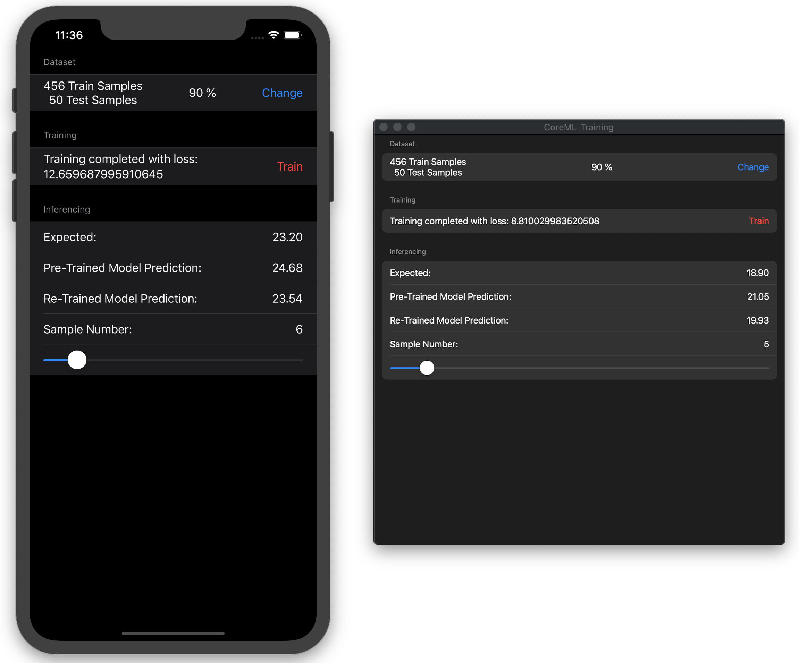
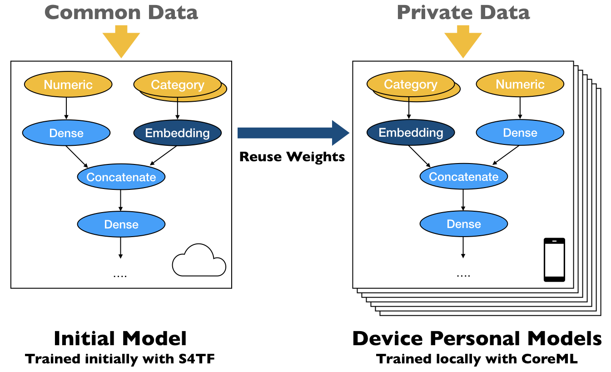
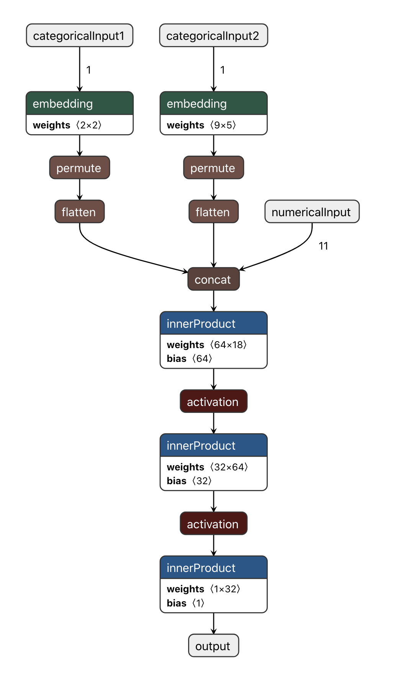

# CoreML-TransferLearning-Demo

Swift for TensorFlow Notebook and CoreML + SwiftUI demo App to demonstrate the potentiality of the SwiftCoreMLTools library (https://github.com/JacopoMangiavacchi/SwiftCoreMLTools) to adopt Transfer Learning technique and train on devices tabular data with multiple Numerical and Categorical Features using Embedding and Multi Input.



## Models architectures





## Dataset

The [Boston housing price dataset](https://archive.ics.uci.edu/ml/machine-learning-databases/housing/) (Creator: Harrison, D. and Rubinfeld, D.L. )has 13 numeric/categorical predictive. Median Value (attribute 14) is usually the target.

Attribute Information (in order):

- CRIM     Numerical: per capita crime rate by town
- ZN       Numerical: proportion of residential land zoned for lots over 25,000 sq.ft.
- INDUS    Numerical: proportion of non-retail business acres per town
- CHAS     Categorical: Charles River dummy variable (= 1 if tract bounds river; 0 otherwise)
- NOX      Numerical: nitric oxides concentration (parts per 10 million)
- RM       Numerical: average number of rooms per dwelling
- AGE      Numerical: proportion of owner-occupied units built prior to 1940
- DIS      Numerical: weighted distances to five Boston employment centres
- RAD      Categorical: index of accessibility to radial highways
- TAX      Numerical: full-value property-tax rate per ten thousand dollars
- PTRATIO  Numerical: pupil-teacher ratio by town
- B        Numerical: 1000(Bk - 0.63)^2 where Bk is the proportion of blacks by town
- LSTAT    Numerical: % lower status of the population
- MEDV     Numerical: Median value of owner-occupied homes in a thousand dollar

## Data transformations

- Categorical features are encoded with one-hot-encoding representation and feeded into Embedding layers.
- Numerical features are normalized using ZScore (x' = (x' - MEAN(X)) / STD(X)) fitting only training data
- Dataset is splitted in Train and Test

## S4TF Model

```swift
struct MultiInputs<N: Differentiable, C>: Differentiable {
  var numerical: N
  
  @noDerivative
  var categorical: C

  @differentiable
  init(numerical: N, categorical: C) {
    self.numerical = numerical
    self.categorical = categorical
  }
}

struct RegressionModel: Module {
    var numericalLayer = Dense<Float>(inputSize: 11, outputSize: 32, activation: relu)
    var embedding1 = Embedding<Float>(vocabularySize: 2, embeddingSize: 2)
    var embedding2 = Embedding<Float>(vocabularySize: 9, embeddingSize: 5)
    var embeddingLayer = Dense<Float>(inputSize: (4 + 45), outputSize: 64, activation: relu)
    var allInputConcatLayer = Dense<Float>(inputSize: (32 + 64), outputSize: 128, activation: relu)
    var hiddenLayer = Dense<Float>(inputSize: 128, outputSize: 32, activation: relu)
    var outputLayer = Dense<Float>(inputSize: 32, outputSize: 1)

    @differentiable
    func callAsFunction(_ input: MultiInputs<[Tensor<Float>], [Tensor<Int32>]>) -> Tensor<Float> {
        let numericalInput = numericalLayer(input.numerical[0])
        let embeddingOutput1 = embedding1(input.categorical[0])
        let embeddingOutput1Reshaped = embeddingOutput1.reshaped(to: 
            TensorShape([embeddingOutput1.shape[0], embeddingOutput1.shape[1] * embeddingOutput1.shape[2]]))
        let embeddingOutput2 = embedding2(input.categorical[1])
        let embeddingOutput2Reshaped = embeddingOutput2.reshaped(to: 
            TensorShape([embeddingOutput2.shape[0], embeddingOutput2.shape[1] * embeddingOutput2.shape[2]]))
        let embeddingConcat = Tensor<Float>(concatenating: [embeddingOutput1Reshaped, embeddingOutput2Reshaped], alongAxis: 1)
        let embeddingInput = embeddingLayer(embeddingConcat)
        let allConcat = Tensor<Float>(concatenating: [numericalInput, embeddingInput], alongAxis: 1)
        return allConcat.sequenced(through: allInputConcatLayer, hiddenLayer, outputLayer)
    }
}

var model = RegressionModel()
```

## SwiftCoreMLTools Export Trained Model

```swift
let coremlModel = Model(version: 4,
                        shortDescription: "Regression",
                        author: "Jacopo Mangiavacchi",
                        license: "MIT",
                        userDefined: ["SwiftCoremltoolsVersion" : "0.0.6"]) {
    Input(name: "numericalInput", shape: [11])
    Input(name: "categoricalInput1", shape: [1])
    Input(name: "categoricalInput2", shape: [1])
    Output(name: "output", shape: [1])
    NeuralNetwork {
        Embedding(name: "embedding1",
                     input: ["categoricalInput1"],
                     output: ["outEmbedding1"],
                     weight: model.embedding1.embeddings.transposed().flattened().scalars,
                     inputDim: 2,
                     outputChannels: 2)
        Permute(name: "permute1",
                     input: ["outEmbedding1"],
                     output: ["outPermute1"],
                     axis: [2, 1, 0, 3])
        Flatten(name: "flatten1",
                     input: ["outPermute1"],
                     output: ["outFlatten1"],
                     mode: .last)
        Embedding(name: "embedding2",
                     input: ["categoricalInput2"],
                     output: ["outEmbedding2"],
                     weight: model.embedding2.embeddings.transposed().flattened().scalars,
                     inputDim: 9,
                     outputChannels: 5)
        Permute(name: "permute2",
                     input: ["outEmbedding2"],
                     output: ["outPermute2"],
                     axis: [2, 1, 0, 3])
        Flatten(name: "flatten2",
                     input: ["outPermute2"],
                     output: ["outFlatten2"],
                     mode: .last)
        Concat(name: "concat",
                     input: ["numericalInput", "outFlatten1", "outFlatten2"],
                     output: ["outConcat"])
        InnerProduct(name: "dense1",
                     input: ["outConcat"],
                     output: ["outDense1"],
                     weight: model.allInputConcatLayer.weight.transposed().flattened().scalars,
                     bias: model.allInputConcatLayer.bias.flattened().scalars,
                     inputChannels: 11 + 2 + 5,
                     outputChannels: 64)
        ReLu(name: "Relu1",
             input: ["outDense1"],
             output: ["outRelu1"])
        InnerProduct(name: "dense2",
                     input: ["outRelu1"],
                     output: ["outDense2"],
                     weight: model.hiddenLayer.weight.transposed().flattened().scalars,
                     bias: model.hiddenLayer.bias.flattened().scalars,
                     inputChannels: 64,
                     outputChannels: 32)
        ReLu(name: "Relu2",
             input: ["outDense2"],
             output: ["outRelu2"])
        InnerProduct(name: "dense3",
                     input: ["outRelu2"],
                     output: ["output"],
                     weight: model.outputLayer.weight.transposed().flattened().scalars,
                     bias: model.outputLayer.bias.flattened().scalars,
                     inputChannels: 32,
                     outputChannels: 1)
    }
}
```

## SwiftCoreMLTools Export Trainable Model

```swift
let coremlModel = Model(version: 4,
                        shortDescription: "Regression",
                        author: "Jacopo Mangiavacchi",
                        license: "MIT",
                        userDefined: ["SwiftCoremltoolsVersion" : "0.0.6"]) {
    Input(name: "numericalInput", shape: [11])
    Input(name: "categoricalInput1", shape: [1])
    Input(name: "categoricalInput2", shape: [1])
    Output(name: "output", shape: [1])
    TrainingInput(name: "numericalInput", shape: [11])
    TrainingInput(name: "categoricalInput1", shape: [1])
    TrainingInput(name: "categoricalInput2", shape: [1])
    TrainingInput(name: "output_true", shape: [1])
    NeuralNetwork(losses: [MSE(name: "lossLayer",
                               input: "output",
                               target: "output_true")],
                  optimizer: SGD(learningRateDefault: 0.001,
                                 learningRateMax: 0.3,
                                 miniBatchSizeDefault: 32,
                                 miniBatchSizeRange: [32],
                                 momentumDefault: 0,
                                 momentumMax: 1.0),
                  epochDefault: 500,
                  epochSet: [500],
                  shuffle: true) {
        Embedding(name: "embedding1",
                     input: ["categoricalInput1"],
                     output: ["outEmbedding1"],
                     weight: model.embedding1.embeddings.transposed().flattened().scalars,
                     inputDim: 2,
                     outputChannels: 2)
        Permute(name: "permute1",
                     input: ["outEmbedding1"],
                     output: ["outPermute1"],
                     axis: [2, 1, 0, 3])
        Flatten(name: "flatten1",
                     input: ["outPermute1"],
                     output: ["outFlatten1"],
                     mode: .last)
        Embedding(name: "embedding2",
                     input: ["categoricalInput2"],
                     output: ["outEmbedding2"],
                     weight: model.embedding2.embeddings.transposed().flattened().scalars,
                     inputDim: 9,
                     outputChannels: 5)
        Permute(name: "permute2",
                     input: ["outEmbedding2"],
                     output: ["outPermute2"],
                     axis: [2, 1, 0, 3])
        Flatten(name: "flatten2",
                     input: ["outPermute2"],
                     output: ["outFlatten2"],
                     mode: .last)
        Concat(name: "concat",
                     input: ["numericalInput", "outFlatten1", "outFlatten2"],
                     output: ["outConcat"])
        InnerProduct(name: "dense1",
                     input: ["outConcat"],
                     output: ["outDense1"],
                     inputChannels: 11 + 2 + 5,
                     outputChannels: 64,
                     updatable: true)
        ReLu(name: "Relu1",
             input: ["outDense1"],
             output: ["outRelu1"])
        InnerProduct(name: "dense2",
                     input: ["outRelu1"],
                     output: ["outDense2"],
                     inputChannels: 64,
                     outputChannels: 32,
                     updatable: true)
        ReLu(name: "Relu2",
             input: ["outDense2"],
             output: ["outRelu2"])
        InnerProduct(name: "dense3",
                     input: ["outRelu2"],
                     output: ["output"],
                     inputChannels: 32,
                     outputChannels: 1,
                     updatable: true)
    }
}
```
